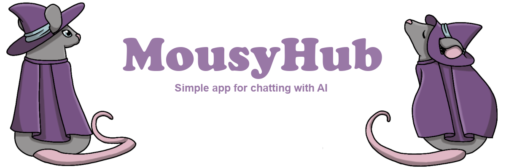
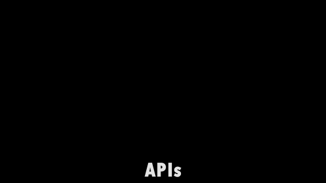

**MousyHub** is a web application for roleplaying with AI-powered characters. It offers a user-friendly interface, easy setup, support for various API providers, and unique features to enhance immersion in conversations.  

  

---  

## 🌟 Key Features  

### 🚀 Multi-API Provider Support  
- **Local Models**: Native execution via `LLamaSharp` (no additional backends required)  
- **KoboldCPP**: An optimal backend for RP models  
- **Cloud Solutions**: OpenRouter, LM Studio, and others (testing required)  

### 🧠 Context Optimization  
- **RAG (Retrieval-Augmented Generation)**: Passive fact-recall system from conversations  
- **Summarization**: Shortens lengthy dialogues to save context  
- **Support for ultra-long conversations**  

### 🌍 Multilingual Support  
- Built-in translator for non-English speakers  

### 🔊 Voice Interaction (Beta)  
- **Dynamic voice synthesis** via `KokoroTTS` (separate voices for characters and narrators)  
- **Voice Mode**: Audio-only mode (currently English-only output)
  
### 📌 Other
- **Import** from Chub AI (support for other providers planned)  

## 🐭 Why MousyHub?  

> *"I wanted to create a convenient alternative to SillyTavern, focused solely on roleplaying."*  

- **Simplified Interface**: Minimal complexity, maximum functionality  
- **Everything You Need for Roleplay** without unnecessary extensions  
- **Focus on Local Models**:  
  - Privacy  
  - Easy setup (especially for beginners)  
  - Support for small RP-fine-tuned models  

## ⬇️ Download and Setup

[-darkgreen?style=for-the-badge&logo=windows&logoColor=white)](https://github.com/PioneerMNDR/MousyHub/releases/latest/download/MousyHub.zip)

### 🚀 Quick Start Guide:
1. **Download** the archive and unzip it to any location  
2. **Launch** `MousyHub.exe` and create your first persona  
3. **Connect** your preferred LLM provider  

✨ *Tip: Right-click the tray icon for quick settings access*

## 💬 Community & Updates

Join our Telegram channel for discussions, latest release news, and donation information! Donations will help speed up the development and release of new updates.

## 🛠️ Technical Details  

### 🔧 Tech Stack  
- **Backend**: C# Blazor Server (.NET 8)  
- **Core Libraries**:  
  - MudBlazor (UI)  
  - LLamaSharp (native model execution)  
  - KokoroTTS (voice synthesis)

### 🐞 Known Issues  
- The app is under active development  
- Bugs and areas needing refactoring may exist  
- Not all cloud APIs have been fully tested  

---  

## 🤝 How to Contribute  

We welcome:  
- Bug reports  
- Improvement ideas  
- Pull requests  
- Testing assistance  

Help from experienced developers is especially appreciated!  

---  

## 🚀 Future Plans  
- [ ] Adding World Info (similar to SillyTavern)  
- [ ] Support for more character card providers  
- [ ] Voice Mode improvements:  
  - Multilingual output  
  - Reduced latency  
- [ ] Extended cloud API testing  

---  

*MousyHub is made with love for the RP community and local AI models!* 🐭❤️
